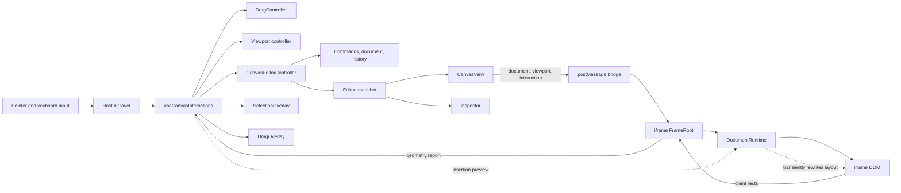
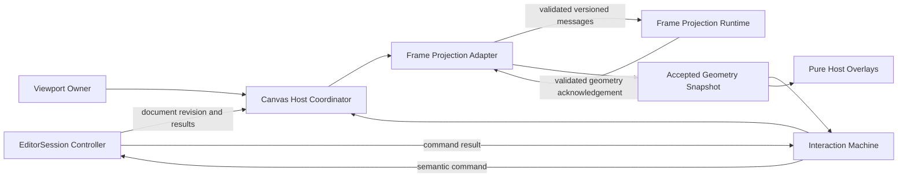
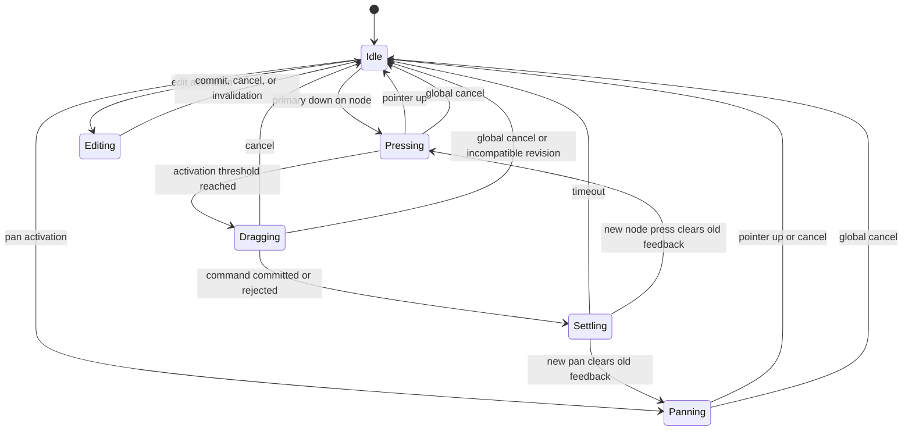
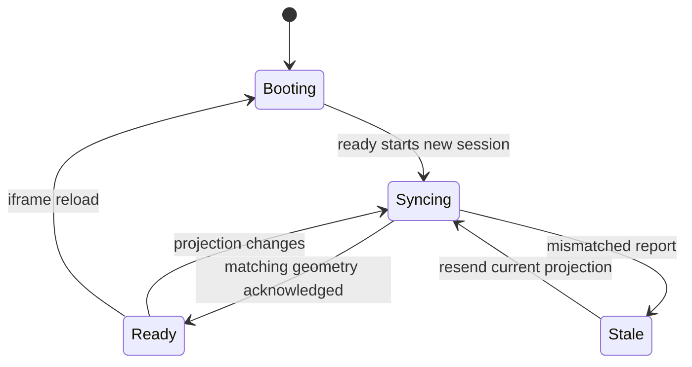
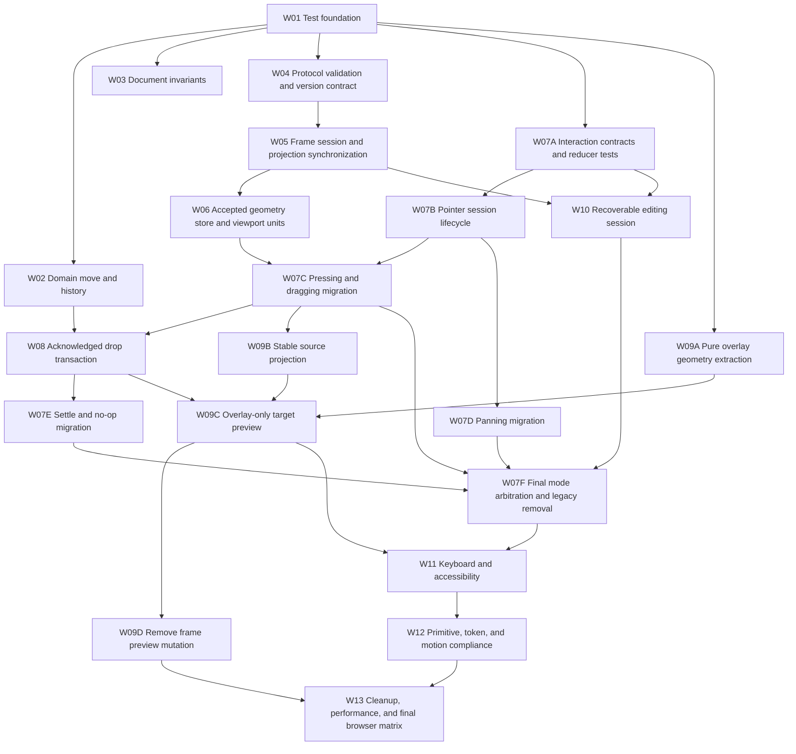

# Canvas Architecture Hardening Plan

## Document status

| Field | Value |
| --- | --- |
| Status | Ready for implementation planning |
| Scope | `apps/frontend-editor/src/canvas` and directly related tests and UI primitives |
| Baseline | `9950437` |
| Risk | High: document history, cross-frame projection, and primary pointer interaction |
| Human acceptance owner | Product owner or requester |
| Governing standards | `docs/frontend/coding-standards.md`, `docs/canvas-functionalities.md`, `docs/development-workflow.md` |

## 1. Purpose

This document turns the Canvas architecture review into one coherent repair program. It is not a list of unrelated bugs. Every work item is tied to a small set of system invariants, an explicit dependency order, and observable acceptance criteria.

The current architecture has a sound high-level direction:

- `CanvasEditorController` owns the document, selection, revision, and history.
- Domain operations are pure TypeScript.
- The Host owns editor interaction and overlays.
- The iframe isolates user content and supplies DOM geometry.

The main weakness is consistency across boundaries. Document state, viewport state, interaction state, frame state, geometry, timers, and pointer lifecycle are copied through several stores without one atomic projection identity. This permits combinations that are individually type-correct but globally invalid.

The repair must establish explicit ownership and enforceable invariants before adding more Canvas capabilities.

## 2. Scope and change budget

### 2.1 Allowed scope

The implementation may change the following areas as needed:

| Area | Allowed changes |
| --- | --- |
| Domain Core | Command semantics, move index contract, document validation, result types, history transaction rules |
| Application | `CanvasEditorController` command acknowledgement, undo/redo behavior, selection policy |
| Integration | Host-to-frame protocol, runtime message validation, frame session handshake, projection versioning |
| Interaction | Replace independent drag, pan, edit, and settle state with a reducer or explicit state machine |
| Viewport | Unit contracts, fit behavior, wheel normalization, lifecycle cancellation |
| Runtime | Remove transient editor behavior that rewrites the authoritative user component tree |
| Overlay | Extract pure insertion geometry and make feedback depend on acknowledged results |
| UI | Canvas toolbar primitives, focus behavior, status announcements, reduced motion |
| Tests | Add unit, controller, protocol, component, and browser tests plus package scripts |
| Documentation | Update M2, M3, and M5 plans when final behavior differs from their recorded decisions |

### 2.2 Maximum change boundary

The repair may refactor the complete `apps/frontend-editor/src/canvas` subtree. It may also change directly related code in `apps/frontend-editor/src/editor`, package scripts, test configuration, and shared platform primitives when required for Canvas compliance.

The repair must not become a general editor-shell rewrite. Changes outside those boundaries require a separately documented reason and acceptance criteria.

### 2.3 Compatibility policy

There is no persisted Canvas document migration in scope. Internal TypeScript contracts and the same-origin frame protocol may change without a compatibility adapter because Host and frame ship together.

Do not add backward-compatibility branches for old frame messages. Reloading both entries is the migration strategy.

### 2.4 Non-goals

- Do not add collaboration, network persistence, or server acknowledgement.
- Do not add a generic event bus.
- Do not add a state-machine dependency unless a reducer and discriminated unions cannot express the required transitions.
- Do not redesign the visual language of the editor.
- Do not add new Canvas node kinds while repairing invariants.
- Do not normalize the entire document tree unless profiling proves the current recursive model is the blocker.

## 3. Current architecture



### 3.1 Current ownership map

| State | Intended owner | Current copies | Assessment |
| --- | --- | --- | --- |
| Document | `CanvasEditorController` | React snapshot, iframe state, frame DOM | Correct direction; projection consistency is missing |
| History | `CanvasEditorController` | Snapshot flags | Owner is correct; transaction semantics are unsafe |
| Selection | `CanvasEditorController` | Canvas and Inspector consumers | Owner is correct; command selection policy causes races |
| Viewport | `useViewportController` | interaction ref, iframe state, CSS transform and zoom | Host is owner; copies have no version identity |
| Drag | `DragController` | React state mirror, iframe dragging ID | Split across imperative state and React state |
| Pan | `useViewportController` | `panStartRef`, `isPanning` | Can overlap with drag candidate state |
| Editing | Host session identity | iframe editing state and iframe-local draft | Draft ownership conflicts with the documented Host-owned model |
| Geometry | iframe DOM | frame rect ref, world geometry state, world geometry ref, live preview | No atomic snapshot or accepted-version rule |
| Frame readiness | Host boolean | iframe lifecycle | A boolean cannot represent reload generations |
| Settle feedback | Host React state and timer | Drag overlay | Can coexist with a new drag and lacks complete rendering data |

### 3.2 Coordinate spaces

| Space | Definition | Producer | Consumer |
| --- | --- | --- | --- |
| Client | Browser viewport coordinates | Pointer events | Drag pointer state |
| Host screen | Coordinates relative to `.canvas-viewport` | Client point minus viewport origin | Hit testing and viewport conversion |
| Frame screen | `getBoundingClientRect()` values relative to iframe viewport | Frame DOM measurement | Host raw rect cache |
| World | Unscaled page coordinates | `(screen - pan) / scale` | Drop target and frozen geometry |
| Overlay | Host CSS pixel coordinates | `world * scale + pan` | Selection and drag overlays |

The implementation assumes Host screen and frame screen have identical origins because the iframe is borderless and fills the viewport. This is acceptable only while the assumption is explicit and browser-tested.

The current `pageSize` report is an exception: it uses a zoomed screen measurement but is consumed as a world measurement. That unit mismatch causes non-idempotent Fit behavior.

## 4. Required architecture invariants

Every implementation decision and test must preserve these invariants.

| ID | Invariant |
| --- | --- |
| INV-01 | The Controller is the only writable owner of document, selection, revision, and history. |
| INV-02 | A command either commits document and history changes atomically or changes neither. |
| INV-03 | Every node ID is unique across the complete document tree. |
| INV-04 | Exactly one primary interaction mode is active: idle, pressing, dragging, panning, editing, or settling. |
| INV-05 | Every pointer session has one active `pointerId`, owns pointer capture, and has a global cancellation path. |
| INV-06 | Geometry is accepted only when its complete projection version matches the current Host projection. |
| INV-07 | Every protocol field declares one coordinate space and one unit; conversion occurs at one named boundary. |
| INV-08 | Visible success feedback is produced only from an authoritative `committed` result. |
| INV-09 | Transient editor feedback must not unmount, remount, or mutate the real user component tree. |
| INV-10 | Every cross-frame payload enters as `unknown` and is runtime-validated before use. |
| INV-11 | Every iframe `ready` event starts a new frame session and can recover the complete current projection. |
| INV-12 | Timers, animation frames, observers, pointer capture, and global listeners are owned and fully cleaned up. |
| INV-13 | Pointer and keyboard operations expose equivalent essential editing capability and status feedback. |
| INV-14 | Interaction algorithms remain pure TypeScript where they do not require React or browser lifecycle APIs. |
| INV-15 | Durable repository tests protect every domain and cross-frame invariant. |

## 5. Target architecture

The target uses three state owners rather than one universal store.



### 5.1 EditorSession

Responsibilities:

- Own document, revision, history, and selection.
- Validate document invariants.
- Execute commands atomically.
- Return complete structured results.
- Never depend on React, DOM, or frame state.

### 5.2 InteractionMachine

Responsibilities:

- Own the primary interaction mode.
- Own active pointer ID and capture lifecycle.
- Translate raw input into semantic actions.
- Cancel on blur, visibility loss, capture loss, frame reset, or incompatible document revision.
- Wait for command acknowledgement before entering success feedback.

Recommended state model:

```ts
type CanvasInteractionState =
  | { status: 'idle'; hoverNodeId: CanvasNodeId | null }
  | {
      status: 'pressing'
      pointerId: number
      nodeId: CanvasNodeId
      origin: Point
      current: Point
      startedAt: number
    }
  | {
      status: 'dragging'
      pointerId: number
      nodeId: CanvasNodeId
      pointer: Point
      geometryVersion: ProjectionVersion
      target: DropTarget
    }
  | {
      status: 'panning'
      pointerId: number
      activation: 'middle-button' | 'space-primary'
      lastPoint: Point
    }
  | {
      status: 'editing'
      sessionId: string
      nodeId: CanvasNodeId
      initialValue: string
      draft: string
    }
  | {
      status: 'settling'
      nodeId: CanvasNodeId
      outcome: 'committed' | 'rejected'
      target: DropTarget | null
      pointer: Point
      expiresAt: number
    }
```

Recommended transitions:



### 5.3 FrameProjection

Responsibilities:

- Treat every `ready` as a new session.
- Hold only a read-only projection of Host state.
- Echo the exact projection version used for every geometry report.
- Never execute document commands or own history.
- Never own an unrecoverable editing draft.

Recommended version contract:

```ts
interface ProjectionVersion {
  frameSessionId: string
  documentRevision: number
  viewportRevision: number
  interactionRevision: number
}
```

Recommended connection states:



### 5.4 Protocol rules

- Receive `MessageEvent<unknown>`, not `MessageEvent<Union>`.
- Validate object shape, discriminant, numeric finiteness, IDs, and nested data.
- Check `event.origin` and `event.source` on both sides.
- Include `frameSessionId` in every message after `ready`.
- Include the relevant projection version in every state update and geometry report.
- Ignore stale or foreign-session messages without mutating accepted state.
- Log malformed protocol input through a diagnostic boundary; do not convert it into a business rejection.
- Use one recovery path that resends current document, viewport, interaction, and edit draft after every new frame session.

### 5.5 Command result rules

All command outcomes need a common envelope:

```ts
type CanvasCommandResult =
  | {
      status: 'committed'
      commandId: CanvasCommandId
      operation: CanvasCommand['type']
      documentId: CanvasNodeId
      affectedNodeId: CanvasNodeId
      revision: number
      canUndo: boolean
      canRedo: boolean
    }
  | {
      status: 'rejected' | 'no-op' | 'cancelled'
      commandId: CanvasCommandId
      operation: CanvasCommand['type']
      documentId: CanvasNodeId
      nodeId: CanvasNodeId | null
      revision: number
      code: string
      recoverable: boolean
      message: string
    }
```

No UI may infer success from a candidate target or from the act of dispatching a command.

## 6. Work package dependency graph



Work packages should be separate commits where practical. Do not combine protocol migration, interaction migration, and visual cleanup in one commit.

### 6.1 Incremental interaction migration

W07 is a migration sequence, not one implementation branch. Each sub-package must be independently mergeable and must leave the Canvas operational.

| Package | Scope | Must not include | Exit condition | Can proceed in parallel with |
| --- | --- | --- | --- | --- |
| W07A | Define interaction state and event unions, pure reducer, transition table, and exhaustive reducer tests | React rewiring, visual changes, protocol changes | Pure tests cover every allowed and forbidden transition; runtime behavior is unchanged | W02 through W06, W09A |
| W07B | Introduce active pointer ID ownership, capture/release adapter, and global cancellation events | Drag target changes, pan algorithm changes, overlay changes | Existing drag and pan behavior use one pointer lifecycle and always terminate | W09A, W10 after W07A |
| W07C | Move pending/pressing and active drag transitions from `DragController` and scattered React state into the reducer | Panning migration, editing draft migration, overlay redesign | Drag activation, target updates, cancellation, and revision invalidation are reducer-owned; old drag state is removed | W07D after W07B |
| W07D | Move middle-button and Space-primary panning into the reducer while preserving viewport math | Drag feedback redesign, keyboard navigation features | Drag and pan are type-level mutually exclusive and share cancellation lifecycle | W07C after W07B |
| W07E | Move committed, rejected, no-op, cancelled, and timeout feedback into exclusive settle states | User-component preview redesign | Settle has complete render data, cannot overlap a new gesture, and follows command results | W09B and W09C preparation |
| W07F | Integrate editing mode arbitration, remove legacy refs/controllers, and make the reducer the only interaction owner | New accessibility features or visual restyling | No primary mode is dual-owned; legacy `DragController` and mirrored state paths are deleted | W09C or W09D |

Migration rules:

1. Do not run the reducer and legacy code as writable owners of the same state.
2. Migrate one state slice at a time and delete its legacy writes in the same sub-package.
3. Keep selectors or read-only adapters only when they are required by unmigrated consumers.
4. Do not introduce a long-lived feature flag for internal interaction state.
5. Run the complete existing browser matrix after every sub-package, not only after W07F.
6. Permit W08, W09, and W10 work as soon as their narrow prerequisites are complete; they must not wait for W07F unless they require final mode arbitration.

### 6.2 Incremental overlay-only preview migration

W09 must also avoid a one-step replacement of the drag rendering pipeline.

| Package | Scope | Must not include | Exit condition | Can proceed in parallel with |
| --- | --- | --- | --- | --- |
| W09A | Extract insertion metrics, coordinate conversion, and no-op presentation into pure TypeScript with characterization tests | Runtime layout changes, interaction state changes | Existing visuals are preserved and geometry algorithms are covered without React | W04 through W07B |
| W09B | Keep the real dragged source node mounted and stable during drag; move source dimming to editor-owned presentation where possible | Target preview removal | Stateful source component mount count and local state remain stable during drag | W07D, W07E |
| W09C | Render target insertion band, line, highlight, and ghost entirely from accepted geometry in the Host overlay | Protocol and CSS cleanup unrelated to the preview | Target feedback no longer requires inserting the dragged node into the live target tree | W07E, W10 |
| W09D | Remove frame insertion-preview mutation, preview registries, dead protocol fields, displaced state, and obsolete frame CSS | New interaction behavior | Frame runtime returns to a read-only document projection and all obsolete paths are deleted | W11, W12 |

W09B is intentionally separate from W09C. Stabilizing the source component is the highest-value runtime isolation fix and can land before the complete target-preview replacement.

## 7. Detailed issue catalog

### CAN-001: Same-parent move inverse uses the wrong index space

| Field | Detail |
| --- | --- |
| Priority | P1 |
| Invariants | INV-02 |
| Evidence | `core/document.ts:168-183`, `core/commands.ts:228-236` |
| Problem | `moveNodeIn` accepts a pre-removal target index and adjusts forward moves. The inverse stores `fromIndex` without converting it into the index space required when replayed from the new position. |
| Impact | Undo restores the wrong sibling order or returns `no-op`. Document state and user expectations diverge. |
| Dependencies | W01 test foundation |
| Allowed scope | `core/document.ts`, `core/commands.ts`, command tests, documentation of move index semantics |
| Repair | Define one index contract. Prefer a post-removal destination index for core operations. Convert drop-target boundary indices at the application boundary. Generate inverse commands using the same contract. |
| Expected result | Every committed move followed by Undo restores the exact previous tree. Redo restores the exact moved tree. |
| Acceptance | Exhaustively test all source and target index pairs in same-parent lists of lengths 1 through 6, plus cross-parent moves. |

### CAN-002: Undo and Redo move history before command success

| Field | Detail |
| --- | --- |
| Priority | P1 |
| Invariants | INV-02 |
| Evidence | `editor/controller.ts:60-75`, `core/history.ts:32-59` |
| Problem | `popUndo` and `popRedo` produce and install the next history before the inverse or forward command is known to be committed. |
| Impact | A rejected or no-op replay consumes history and advertises false `canUndo` or `canRedo` state. |
| Dependencies | CAN-001 for the known failing inverse case |
| Allowed scope | Controller and history APIs, controller tests |
| Repair | Peek first, apply second, and move the entry only after `committed`. Treat replay failure as an invariant violation with diagnostics, while preserving the original history. |
| Expected result | Failed replay leaves document, revision, selection, and history unchanged. |
| Acceptance | Force rejected and no-op replay cases and verify complete snapshot equality before and after. |

### CAN-003: Added subtrees can introduce duplicate IDs

| Field | Detail |
| --- | --- |
| Priority | P2 |
| Invariants | INV-03 |
| Evidence | `core/commands.ts:119-149`, registry maps in `runtime/DocumentRuntime.tsx` |
| Problem | Add validation checks only `command.node.id`. It does not check descendant IDs, duplicates inside the incoming subtree, or intersection with existing document IDs. |
| Impact | Tree lookup returns the first match while DOM and geometry maps overwrite by ID. Selection, editing, removal, and drag may address different nodes. |
| Dependencies | W01 |
| Allowed scope | Domain validation utilities, provider initialization validation, tests |
| Repair | Traverse incoming and existing trees, reject internal duplicates and all intersections. Validate initial documents once at session creation. |
| Expected result | Node ID is a reliable identity across domain, DOM registry, geometry, and protocol. |
| Acceptance | Cover duplicate root, duplicate descendant, internal subtree duplicate, and valid deeply nested subtree. |

### CAN-004: Command results do not provide a complete acknowledgement contract

| Field | Detail |
| --- | --- |
| Priority | P2 |
| Invariants | INV-02, INV-08 |
| Evidence | `core/commands.ts:58-79`, `docs/canvas-functionalities.md:233-262` |
| Problem | Rejected and no-op results omit command ID, operation, document ID, revision, node context, and recoverability. There is no cancelled outcome. |
| Impact | Callers infer state, cannot correlate feedback, and cannot distinguish business refusal from cancelled interaction. |
| Dependencies | CAN-002 |
| Allowed scope | Domain result types, controller API, interaction callers, tests |
| Repair | Introduce the common result envelope described in section 5.5. Keep program exceptions separate from business results. |
| Expected result | Every interaction can render feedback from one explicit authoritative outcome. |
| Acceptance | Type-level exhaustive handling and tests for committed, rejected, no-op, and cancelled outcomes. |

### CAN-005: Geometry revision is emitted but never enforced

| Field | Detail |
| --- | --- |
| Priority | P1 |
| Invariants | INV-06 |
| Evidence | `frame/bridge.ts:45-53`, `interaction/useCanvasInteractions.ts:391-448` |
| Problem | Host accepts every geometry report and combines it with the latest Host document and viewport, regardless of the projection that produced the rects. |
| Impact | Stale selection boxes, wrong hit targets, wrong drag geometry, and incorrect drop indices under rapid updates. |
| Dependencies | W04 protocol contract |
| Allowed scope | Bridge contracts, frame adapter, geometry acceptance store, related consumers |
| Repair | Attach and validate the full `ProjectionVersion`. Keep the last accepted geometry immutable. Ignore mismatches without replacing it. |
| Expected result | Geometry never crosses document, viewport, interaction, or frame-session generations. |
| Acceptance | Deliver reports out of order in protocol tests and verify only the exact current version is accepted. |

### CAN-006: Frame document and revision are not stored atomically

| Field | Detail |
| --- | --- |
| Priority | P1 |
| Invariants | INV-06 |
| Evidence | `frame/FrameRoot.tsx:15,21,31-33,51-65` |
| Problem | Revision is updated in a ref before React commits the corresponding document state. A callback using the previous document can report geometry with the newer revision. |
| Impact | A stale projection can be mislabeled as current, defeating document-only revision checks. |
| Dependencies | CAN-005 |
| Allowed scope | Frame projection state and measurement adapter |
| Repair | Store document and projection version in one state object. Measurement must capture one committed projection object and echo its version. |
| Expected result | A report can never pair one document with another document's revision. |
| Acceptance | Simulate document update and observer callback interleaving; assert atomic version-document pairing. |

### CAN-007: Viewport and interaction changes have no protocol revision

| Field | Detail |
| --- | --- |
| Priority | P1 |
| Invariants | INV-06, INV-07 |
| Evidence | `frame/bridge.ts:32-53`, `CanvasView.tsx:48-94` |
| Problem | Only document updates carry a revision. Geometry produced by old zoom, pan, or insertion-preview state is indistinguishable from current geometry. |
| Impact | Old screen rects may be converted with a new transform, producing invalid world coordinates. |
| Dependencies | CAN-005, CAN-006 |
| Allowed scope | Projection protocol and Host projection coordinator |
| Repair | Add monotonic viewport and interaction revisions and include them in reports. Increment only when the corresponding authoritative state changes. |
| Expected result | Screen-to-world conversion always uses the transform that produced the screen rect. |
| Acceptance | Stress rapid zoom, pan, and drag-preview changes with delayed reports. |

### CAN-008: Frame readiness is modeled as a boolean instead of a session

| Field | Detail |
| --- | --- |
| Priority | P2 |
| Invariants | INV-11 |
| Evidence | `CanvasView.tsx:27,70-103` |
| Problem | A second `ready` event calls `setFrameReady(true)` when the value is already true, so no recovery effect runs. |
| Impact | Frame-only reload or hot replacement can leave the iframe blank until unrelated Host state changes. |
| Dependencies | W04 |
| Allowed scope | CanvasView frame lifecycle and projection adapter |
| Repair | Treat each `ready` as a new session ID or incrementing generation and immediately resend the complete current projection. Reset accepted geometry for the old session. |
| Expected result | Any frame reload recovers without user action or document mutation. |
| Acceptance | Reload only the iframe and verify document, viewport, interaction, edit draft, and geometry recover. |

### CAN-009: Cross-frame payloads are trusted without runtime validation

| Field | Detail |
| --- | --- |
| Priority | P2 |
| Invariants | INV-10 |
| Evidence | `CanvasView.tsx:96-105`, `frame/FrameRoot.tsx:26-44` |
| Problem | `MessageEvent` is parameterized with an internal union, which does not validate runtime data. Frame checks origin but not source. |
| Impact | Malformed or foreign same-origin messages can mutate projection state or cause runtime exceptions. |
| Dependencies | W04 |
| Allowed scope | Add a dedicated protocol parser module and tests; update both listeners |
| Repair | Receive `unknown`, validate every variant, check origin and exact source on both sides, and reject non-finite geometry values. |
| Expected result | Only valid messages from the active peer can enter application state. |
| Acceptance | Test null, arrays, missing fields, unknown variants, invalid numbers, stale sessions, and wrong source. |

### CAN-010: Projection effects resend unrelated state and duplicate messages

| Field | Detail |
| --- | --- |
| Priority | P2 |
| Invariants | INV-11, INV-12 |
| Evidence | `CanvasView.tsx:48-94` |
| Problem | Three focused effects send their channels, while the ready effect depends on all channel state and sends all three again after every change. |
| Impact | Document structured cloning occurs during viewport and drag updates, and every normal update is duplicated. |
| Dependencies | CAN-008 |
| Allowed scope | Projection coordinator effects only |
| Repair | Use one explicit ready-session recovery action and one effect per normal channel. Do not make the recovery effect reactive to all projection fields. |
| Expected result | Document is sent on document revision changes and frame recovery only. |
| Acceptance | Instrument message counts for document, viewport, interaction, and ready recovery. |

### CAN-011: Fit consumes zoomed screen size as world size

| Field | Detail |
| --- | --- |
| Priority | P2 |
| Invariants | INV-07 |
| Evidence | `frame/FrameRoot.tsx:60-62,89`, `viewport/useViewportController.ts:141-150` |
| Problem | `getBoundingClientRect()` includes CSS zoom, but `fitViewport` expects unscaled page dimensions. |
| Impact | Repeated Fit can alternate between correct fit and near 100 percent instead of being idempotent. |
| Dependencies | CAN-007 for explicit viewport versioning |
| Allowed scope | Page-size protocol, measurement adapter, viewport tests |
| Repair | Report world page size from unzoomed layout measurement or divide screen size by the exact projection scale. Name the field `pageWorldSize`. |
| Expected result | Fit produces the same transform from every starting zoom. |
| Acceptance | Run Fit repeatedly from minimum, maximum, 100 percent, and arbitrary zoom values. |

### CAN-012: Regular node drag does not capture the pointer

| Field | Detail |
| --- | --- |
| Priority | P1 |
| Invariants | INV-04, INV-05, INV-12 |
| Evidence | `interaction/useCanvasInteractions.ts:222-246,296-333` |
| Problem | Pan captures the pointer, but node drag candidate does not. Pointer up outside the hit layer is not guaranteed to arrive. |
| Impact | Pending or dragging state, ghost, insertion preview, and auto-pan can remain active after release. |
| Dependencies | W07B pointer session lifecycle |
| Allowed scope | Host pointer lifecycle, interaction reducer, browser tests |
| Repair | Capture on every accepted primary interaction, store `pointerId`, ignore other pointers, release on completion, and cancel on `lostpointercapture`. |
| Expected result | Every pointer session terminates exactly once. |
| Acceptance | Release outside every viewport edge, cross the iframe boundary, trigger capture loss, and use a second pointer. |

### CAN-013: Global focus and visibility loss do not cancel interactions

| Field | Detail |
| --- | --- |
| Priority | P2 |
| Invariants | INV-05, INV-12 |
| Evidence | Interaction cleanup effects and `viewport/useViewportController.ts:81-94` |
| Problem | There is no shared cancellation path for `window.blur`, hidden documents, or missed Space key-up. |
| Impact | Space-pan can remain active, or drag and pan state can survive application focus loss. |
| Dependencies | CAN-012 |
| Allowed scope | Interaction lifecycle adapter and viewport keyboard handling |
| Repair | Dispatch one global cancel event on blur and visibility loss. Reset Space state, pointer state, auto-pan, and capture. |
| Expected result | Returning to the application always starts from idle unless editing was intentionally persisted. |
| Acceptance | Release Space and pointer while the browser is unfocused, then return and verify idle behavior. |

### CAN-014: Drag activation depends on a later pointer move after the time threshold

| Field | Detail |
| --- | --- |
| Priority | P2 |
| Invariants | INV-04 |
| Evidence | `dnd/drag-controller.ts:85-93` |
| Problem | Activation requires distance and elapsed time, but elapsed time is evaluated only in `move()`. Moving far quickly and then waiting does not activate without another move. |
| Impact | Valid-looking drag gestures are silently treated as clicks. |
| Dependencies | W07C pressing and dragging migration |
| Allowed scope | Interaction activation policy and tests |
| Repair | Define the intended policy first. If both delay and distance are required, dispatch an explicit timer event and retain current pointer. If distance alone is intended, remove the time gate. |
| Expected result | Activation behavior is deterministic and documented. |
| Acceptance | Cover slow move, fast move, move-then-hold, hold-then-move, and release before activation. |

### CAN-015: Document-changing shortcuts remain active during drag

| Field | Detail |
| --- | --- |
| Priority | P1 |
| Invariants | INV-04, INV-06, INV-08 |
| Evidence | `interaction/useCanvasInteractions.ts:342-389` |
| Problem | Delete, Undo, and Redo execute while drag geometry is frozen against an earlier document revision. |
| Impact | The dragged node or target structure can change mid-gesture, then release attempts a stale move. |
| Dependencies | CAN-005, CAN-007, W07C |
| Allowed scope | Keyboard semantic mapping and interaction transitions |
| Repair | While pressing or dragging, allow only cancellation and documented drag controls. Cancel active drag when an incompatible document revision arrives. |
| Expected result | Drop geometry and document revision remain compatible for the complete gesture. |
| Acceptance | Attempt Delete, Undo, Redo, Inspector selection, and external document commands during drag. |

### CAN-016: Drop feedback ignores the authoritative command result

| Field | Detail |
| --- | --- |
| Priority | P1 |
| Invariants | INV-02, INV-08 |
| Evidence | `interaction/useCanvasInteractions.ts:97-109,296-317` |
| Problem | The drop callback discards `controller.execute()` output. Pointer-up marks the target placed based only on the candidate. |
| Impact | Rejected or stale commands show successful placement feedback. |
| Dependencies | CAN-004, CAN-015 |
| Allowed scope | Drag command boundary, state-machine result events, overlay feedback |
| Repair | Make drop produce a structured result event. Enter committed settle only for `committed`, rejected settle for `rejected`, and idle for no-op or cancelled according to UX policy. |
| Expected result | Visible feedback always matches document state. |
| Acceptance | Force domain rejection after a valid preview and verify no placed state is rendered. |

### CAN-017: Settle state is incomplete and can overlap a new gesture

| Field | Detail |
| --- | --- |
| Priority | P2 |
| Invariants | INV-04, INV-08, INV-12 |
| Evidence | `dnd/drag-controller.ts:19-27`, `interaction/useCanvasInteractions.ts:301-317`, `overlay/DragOverlay.tsx:34-102` |
| Problem | Placed settle lacks node ID; rejected settle lacks pointer coordinates. A new pointer down does not clear the old settle timer and state. |
| Impact | Placed ghost cannot render after drag reset, rejection disappears immediately, and a rapid next drag can inherit the previous fade animation. |
| Dependencies | W07E and CAN-016 |
| Allowed scope | Interaction state union, timer lifecycle, DragOverlay props |
| Repair | Make settling a complete exclusive machine state. Store all rendering data and clear its timer on every outgoing transition. |
| Expected result | Feedback renders independently of old drag state and never affects a new gesture. |
| Acceptance | Test committed, rejected, no-op, cancelled, rapid second drag, and unmount during settle. |

### CAN-018: No-op insertion feedback uses an algorithm that excludes no-op targets

| Field | Detail |
| --- | --- |
| Priority | P2 |
| Invariants | INV-07, INV-08 |
| Evidence | `overlay/DragOverlay.tsx:55-60,231-233`, `interaction/useCanvasInteractions.ts:129-137` |
| Problem | No-op now reaches `insertionMetrics`, although the function assumes it cannot. At the same time, real `liveSlot` geometry is disabled for no-op. |
| Impact | A node dragged over its own position can show an insertion band over a neighbor or an expanded parent. |
| Dependencies | W09A geometry extraction and W09C target preview |
| Allowed scope | Pure insertion geometry and no-op UX policy |
| Repair | Decide whether no-op shows source-position feedback or no insertion feedback. Encode it as a separate target presentation rather than passing through move metrics. |
| Expected result | No-op feedback is visually stable and cannot imply a structural move. |
| Acceptance | Cover every same-parent original position in row and column layouts. |

### CAN-019: Drag preview rewrites the real user component tree

| Field | Detail |
| --- | --- |
| Priority | P1 architecture |
| Invariants | INV-09 |
| Evidence | `runtime/DocumentRuntime.tsx:125-198,212-231` |
| Problem | Runtime removes the source node and renders it under a target slot during drag. This unmounts and remounts the projected user component and mutates real layout. |
| Impact | Stateful or third-party components can lose local state, run effects, close portals, or change behavior during an editor-only gesture. Geometry also enters a feedback loop. |
| Dependencies | CAN-005 through CAN-007, W07C, CAN-016, W09B, and W09C |
| Allowed scope | Runtime projection contract, frame measurement, Host overlay, optional non-interactive frame placeholder |
| Repair | Keep the real document projection structurally unchanged. Render ghost, insertion band, highlight, and displacement in an editor-owned overlay. If exact target sizing requires frame measurement, use a separate isolated measurement surface that is not the live user tree. |
| Expected result | Dragging never changes component identity or user runtime state before commit. |
| Acceptance | Use a stateful test component with mount counters, focus, input value, and portal state; drag without drop and verify no remount or state loss. |

### CAN-020: Geometry invalidation does not cover all DOM changes

| Field | Detail |
| --- | --- |
| Priority | P2 |
| Invariants | INV-06, INV-12 |
| Evidence | `frame/FrameRoot.tsx:67-77` |
| Problem | ResizeObserver watches only the page element. Child movement or size changes that do not change the page border box may not produce a report. |
| Impact | Fonts, images, fixed-size rows, portals, or dynamic child content can leave hit testing and overlays stale. |
| Dependencies | Accepted geometry store from W06 |
| Allowed scope | Frame measurement adapter and invalidation policy |
| Repair | Observe registered geometry-bearing nodes or use a batched invalidation registry. Include font readiness and relevant resource load events. Coalesce reports per animation frame. |
| Expected result | Any visible geometry change invalidates the accepted snapshot without report storms. |
| Acceptance | Test asynchronous font load, image load, child-only resize, node mount/unmount, and fixed page size. |

### CAN-021: Hit testing assumes parent clipping and document order equals paint order

| Field | Detail |
| --- | --- |
| Priority | P3 now, P2 before advanced components |
| Invariants | INV-07 |
| Evidence | `frame/snapshot.ts:32-49` |
| Problem | Descendants are visited only if the parent rect contains the point, and the last document-order match wins. Overflow, transforms, sticky elements, and overlapping layers can violate both assumptions. |
| Impact | Visible nodes may be unselectable or the wrong overlapping node may be selected. |
| Dependencies | W06 and final user-component rendering model |
| Allowed scope | Hit-test model, geometry metadata, browser tests |
| Repair | Record paint-relevant metadata or obtain a frame-generated hit stack. Do not adopt `elementFromPoint` across the boundary without a protocol and adapter design. |
| Expected result | Hit testing follows visible paint behavior for supported component categories. |
| Acceptance | Test overflow, transform, overlap, sticky, fixed, and portal cases before declaring those categories supported. |

### CAN-022: Editing draft ownership and recovery are split across Host and iframe

| Field | Detail |
| --- | --- |
| Priority | P2 |
| Invariants | INV-04, INV-11 |
| Evidence | `frame/FrameRoot.tsx:20,38-43`, `runtime/DocumentRuntime.tsx:302-315` |
| Problem | Host owns only editing identity while iframe owns the current draft. `FrameEditingState.initialValue` is sent but not used as a controlled value. `editingValueRef` is threaded through the runtime but passed as `undefined`. |
| Impact | Frame reload loses uncommitted input, protocol state cannot recover, and dead compatibility paths increase complexity. |
| Dependencies | CAN-008 and W07A; implemented in W10 |
| Allowed scope | Editing protocol, interaction state, InlineEditor props, dead ref removal |
| Repair | Store draft in Host interaction state. Add validated `editChange` events and send controlled draft in interaction projection. Recover it after frame reload. |
| Expected result | Editing has one owner and survives projection recreation. |
| Acceptance | Type text, reload frame, and verify draft, selection range policy, and edit session recover. |

### CAN-023: Inline editing keyboard semantics are inconsistent

| Field | Detail |
| --- | --- |
| Priority | P2 |
| Invariants | INV-13 |
| Evidence | `runtime/DocumentRuntime.tsx:332-343` |
| Problem | Enter commits text but not button labels. Shift+Enter inserts a newline into a visually single-line textarea. |
| Impact | The documented Enter contract fails for buttons, and hidden multiline data can be committed for text nodes. |
| Dependencies | CAN-022 |
| Allowed scope | InlineEditor semantic callbacks and tests |
| Repair | Define one single-line policy: Enter commits both node kinds, Escape cancels, and all newline-producing Enter variants are prevented unless multiline text becomes an explicit feature. |
| Expected result | Text and button editing use identical documented commit and cancel semantics. |
| Acceptance | Test Enter, Shift+Enter, Escape, blur, unchanged value, empty value, and composition input. |

### CAN-024: Async edit commit can override a newer selection

| Field | Detail |
| --- | --- |
| Priority | P2 |
| Invariants | INV-01, INV-04 |
| Evidence | `interaction/useCanvasInteractions.ts:450-458`, `editor/controller.ts:95-99`, Inspector selection flow |
| Problem | Clicking another Host panel blurs the iframe editor and queues a commit message. The Host click can select another node first; the later text command then selects the edited node again. |
| Impact | User selection appears to jump back after clicking the Inspector tree. |
| Dependencies | CAN-022 and command selection policy review |
| Allowed scope | Edit session result handling and Controller selection policy |
| Repair | Include edit session ID and selection generation. Text commands should preserve a selection that changed after editing started unless product behavior explicitly says otherwise. |
| Expected result | A deliberate later selection wins over an older edit acknowledgement. |
| Acceptance | Commit by clicking every Host panel and verify final selection follows the user's latest action. |

### CAN-025: Space-pan and wheel behavior are not lifecycle- or device-safe

| Field | Detail |
| --- | --- |
| Priority | P3 |
| Invariants | INV-05, INV-12 |
| Evidence | `viewport/useViewportController.ts:23-31,60-94` |
| Problem | Non-zoom wheel panning ignores `deltaMode`, and Space state resets only on key-up. |
| Impact | Pan speed varies by device and Space-pan may remain active after focus loss. |
| Dependencies | CAN-013 |
| Allowed scope | Viewport input adapter and tests |
| Repair | Normalize both wheel axes and route global cancellation through the interaction lifecycle. Ignore Space activation while typing in editable controls. |
| Expected result | Predictable panning across pixel, line, and page delta devices. |
| Acceptance | Test representative trackpad and mouse delta modes plus focus loss while Space is held. |

### CAN-026: Interaction responsibilities are concentrated in one universal Hook

| Field | Detail |
| --- | --- |
| Priority | P2 maintainability |
| Invariants | INV-04, INV-12, INV-14 |
| Evidence | `interaction/useCanvasInteractions.ts:61-552` |
| Problem | One Hook owns pointer input, keyboard commands, timers, auto-pan, frame protocol handling, geometry conversion, editing, drag commit, and insertion algorithms. |
| Impact | State transitions are implicit, effects are difficult to test, and unrelated changes can violate hidden combinations. |
| Dependencies | W04, W06, and W07A through W07F |
| Allowed scope | Split by responsibility, not by arbitrary line count |
| Repair | Extract a pure interaction reducer, protocol adapter, auto-pan lifecycle, accepted geometry store, and pure insertion-preview selectors. Keep the React Hook as a thin binding layer. |
| Expected result | Core transitions can be tested in Node without React or DOM. |
| Acceptance | The binding Hook contains lifecycle wiring and semantic dispatch, while transition and geometry tests run as pure unit tests. |

### CAN-027: DragOverlay contains a large layout algorithm inside TSX

| Field | Detail |
| --- | --- |
| Priority | P2 maintainability |
| Invariants | INV-14 |
| Evidence | `overlay/DragOverlay.tsx:178-403` |
| Problem | Rendering, coordinate conversion, live-slot reconciliation, and insertion geometry are coupled in one TSX module. |
| Impact | Geometry regressions require browser-level debugging and no-op assumptions drift from callers. |
| Dependencies | W09A |
| Allowed scope | Overlay module and pure geometry tests |
| Repair | Move insertion metrics and projection conversion to named pure TypeScript modules with explicit coordinate-space types. Keep DragOverlay declarative. |
| Expected result | Row, column, empty, edge, middle, no-op, and live-measurement cases are deterministic unit tests. |
| Acceptance | TSX no longer contains deep layout arithmetic or hidden no-op assumptions. |

### CAN-028: Canvas accessibility contract is incomplete

| Field | Detail |
| --- | --- |
| Priority | P1 product compliance, P2 implementation order |
| Invariants | INV-13 |
| Evidence | `CanvasView.tsx:165-190`, `interaction/useCanvasInteractions.ts:342-389`, `runtime/DocumentRuntime.tsx:258-269`, `overlay/DragOverlay.tsx:104-160` |
| Problem | Essential movement is pointer-only. Rejection status is inside `aria-hidden`. Runtime buttons are removed from tab order, and the application surface does not expose active descendant semantics. |
| Impact | Keyboard and assistive-technology users cannot perform or understand core Canvas operations. |
| Dependencies | W07F final mode arbitration, W09C overlay target preview, and W10 editing session |
| Allowed scope | Keyboard command mapping, focus model, ARIA status component, browser accessibility tests |
| Repair | Implement the keyboard contract from `docs/canvas-functionalities.md:264-283`, including traversal, editing, structural navigation, reorder, keyboard drop target selection, and polite status announcements. |
| Expected result | Essential edit operations do not require drag. Focus and status are observable. |
| Acceptance | Keyboard-only E2E and axe checks with no serious or critical findings. |

### CAN-029: Inline controls lack accessible names and visible focus

| Field | Detail |
| --- | --- |
| Priority | P2 |
| Invariants | INV-13 |
| Evidence | `runtime/DocumentRuntime.tsx:349-396`, `frame/frame.css:152-188` |
| Problem | Input and textarea have no label, while CSS removes the outline without a replacement focus-visible ring. |
| Impact | Screen-reader purpose is unclear and keyboard focus is not visible. |
| Dependencies | CAN-022, platform field primitive decision |
| Allowed scope | Inline editor semantics and scoped frame styles |
| Repair | Supply semantic accessible names and token-based focus-visible styling. Preserve the edited node's measured dimensions. |
| Expected result | Editing control purpose and focus are clear without changing layout. |
| Acceptance | Accessible-name test, keyboard focus screenshot, and computed style checks. |

### CAN-030: Platform UI bypasses primitive, token, and motion requirements

| Field | Detail |
| --- | --- |
| Priority | P2 standards compliance |
| Invariants | INV-13 |
| Evidence | Native toolbar buttons in `CanvasView.tsx:126-160`; raw values in `styles/canvas.css:64-255` |
| Problem | Toolbar controls are feature-local native buttons. Overlay CSS uses anonymous shadows, z-index values, 150/190 ms timings, custom easing, and no reduced-motion rule. |
| Impact | Focus, disabled behavior, motion, and visual rules diverge from platform components and Spectrum token policy. |
| Dependencies | Stable behavior from W07F through W11 |
| Allowed scope | Canvas toolbar, shared primitives when necessary, Canvas host CSS |
| Repair | Use platform ActionButton or IconButton primitives. Replace platform visual values with verified semantic tokens or named product tokens. Add `prefers-reduced-motion: reduce`. |
| Expected result | Canvas platform UI follows one component and token system without changing user document styles. |
| Acceptance | Computed style, light/dark, focus-visible, disabled, hover, pressed, and reduced-motion checks. |

### CAN-031: Frame styles and transient classes blur the user-content boundary

| Field | Detail |
| --- | --- |
| Priority | P2 architecture |
| Invariants | INV-09 |
| Evidence | `frame/frame.css`, `.canvas-node-dragging`, `.canvas-node-displaced`, `.canvas-insertion-slot` |
| Problem | Editor-only opacity and preview styling is applied inside the user rendering frame, and token imports are global to the iframe rather than scoped to the page projection. |
| Impact | Editor feedback can alter real user content rendering and future third-party style integration. |
| Dependencies | CAN-019 and W12 |
| Allowed scope | Frame style scoping and Host overlay styles |
| Repair | Remove editor-only layout and visual mutations from the live user tree. Scope user-page token injection below the page root and keep editor overlay styling in Host. |
| Expected result | User content and editor chrome have physically separate style contracts. |
| Acceptance | Verify Host styles do not affect frame content and frame content styles do not affect Host overlays. |

### CAN-032: Dead state paths and conflicting coordinate documentation increase risk

| Field | Detail |
| --- | --- |
| Priority | P3 cleanup |
| Invariants | INV-07, INV-14 |
| Evidence | Unused `editingValueRef`, unused `.canvas-node-preview`, ineffective displaced state, `FramePreviewSlot` world-coordinate comment while carrying frame client rects |
| Problem | Types, comments, props, and CSS describe behavior that does not match runtime ownership or units. |
| Impact | Future changes can double-convert coordinates or preserve state that has no effect. |
| Dependencies | Complete W06, W09D, and W10 first |
| Allowed scope | Remove dead props, selectors, CSS, exports, and stale comments |
| Repair | Keep one name per concept, encode coordinate space in type names, and delete obsolete compatibility paths. |
| Expected result | Public and internal contracts describe actual behavior. |
| Acceptance | No unused semantic path remains; documentation and type names agree with conversion boundaries. |

### CAN-033: Source hygiene rules are not enforced by tooling

| Field | Detail |
| --- | --- |
| Priority | P3 standards compliance |
| Invariants | INV-15 |
| Evidence | Non-ASCII source characters, uppercase underscore constants, inconsistent JSX formatting, no formatter script |
| Problem | Current lint passes despite explicit source hygiene requirements in `coding-standards.md:447-453`. |
| Impact | Manual review repeatedly rediscovers mechanical violations. |
| Dependencies | None; apply after behavior-heavy merges to avoid noisy conflicts |
| Allowed scope | Canvas source, lint or formatting configuration, package scripts |
| Repair | Convert source to ASCII English, rename constants to semantic camelCase, run the repository formatter, and add enforceable checks where available. |
| Expected result | Mechanical rules are automated rather than review-only. |
| Acceptance | CI rejects introduced non-ASCII source and formatting drift without scanning user content or documentation that intentionally permits other languages. |

### CAN-034: There is no durable automated Canvas test suite

| Field | Detail |
| --- | --- |
| Priority | P1 process risk |
| Invariants | INV-15 |
| Evidence | `apps/frontend-editor/package.json` has no test script and the repository has no Canvas test files |
| Problem | Historical smoke and browser checks were temporary files outside the repository. Typecheck, lint, and build do not execute behavior. |
| Impact | History corruption, stale geometry, and Enter regression all pass existing gates. |
| Dependencies | W01 starts first and expands with every package |
| Allowed scope | Test dependencies, configuration, scripts, fixtures, and CI commands |
| Repair | Add committed unit and browser test layers. Every repair item must add its regression test in the same work package. |
| Expected result | The architecture invariants become executable release gates. |
| Acceptance | Fresh checkout can run all tests with documented commands and no temporary files. |

## 8. Test architecture

### 8.1 Domain tests

Required coverage:

- Add, remove, move, and set-text committed paths.
- Rejected and no-op paths.
- Same-parent move matrix and exact inverse restoration.
- Cross-parent move matrix.
- Undo/Redo transaction failure.
- Duplicate IDs in initial and added trees.
- Immutable update and reference preservation.
- Complete command result envelopes.

### 8.2 Pure interaction tests

Required coverage:

- Every valid state transition.
- Every forbidden event in each state.
- Pointer ID isolation.
- Threshold and timer behavior.
- Global cancellation.
- Document revision invalidation.
- Command committed, rejected, no-op, and cancelled outcomes.
- Settle timeout and interruption.

### 8.3 Protocol tests

Required coverage:

- Runtime validation of every message variant.
- Wrong origin, source, session, and projection version.
- Out-of-order geometry.
- Frame reload and complete recovery.
- Atomic document-version measurement.
- Message counts for normal updates and recovery.

### 8.4 Geometry and viewport tests

Required coverage:

- Screen-to-world and world-to-overlay round trips.
- Explicit world and screen page-size contracts.
- Fit idempotence from arbitrary zoom.
- Row, column, block, empty, edge, middle, and no-op insertion geometry.
- Fractional scale and high-DPI behavior.
- Wheel delta modes.

### 8.5 Browser tests

Required coverage:

- Pointer release outside every Canvas edge.
- Lost pointer capture, blur, and visibility loss.
- Drag while attempting Delete, Undo, Redo, and Inspector selection.
- Frame-only reload during idle, drag, pan, and edit.
- Stateful user component does not remount during drag preview.
- Repeated Fit and rapid zoom/pan.
- Text and button editing, composition input, Enter, Escape, blur, and frame reload.
- Keyboard traversal, reordering, status announcement, and focus recovery.
- Light/dark tokens, focus-visible, reduced motion, clipping, and computed font size.
- axe with no serious or critical findings.

Automated browser checks are the implementation responsibility. They provide deterministic evidence for event delivery, DOM state, geometry, focus, computed styles, accessibility rules, and regression behavior. Passing them does not certify subjective visual quality or interaction feel.

### 8.6 Human visual and interaction acceptance

The human acceptance owner makes the final decision for user-visible behavior. Automated implementation tools must not mark these items accepted based only on screenshots, DOM assertions, or generated reports.

Human acceptance is required for:

- Selection, hover, drag ghost, insertion line, insertion band, and rejection clarity.
- Drag activation feel, pointer responsiveness, auto-pan speed, and perceived latency.
- Zoom clarity at representative fractional scales and high-DPI displays.
- Fit composition, page positioning, clipping, and visual stability.
- Inline editing size, alignment, focus indication, and commit/cancel experience.
- Animation duration, easing, interruption behavior, and reduced-motion experience.
- Toolbar affordance, disabled states, keyboard focus visibility, and visual hierarchy.
- Light and dark appearance on representative desktop viewport sizes.
- Any change that claims to preserve existing visuals or improve usability.

Packages W07B through W07E, W09B through W09C, and W10 through W12 use a two-stage result:

| Stage | Meaning | Owner |
| --- | --- | --- |
| Ready for visual review | Implementation and deterministic automated checks pass; evidence and reproduction steps are prepared | Implementer |
| Accepted | The human acceptance owner has exercised the affected scenarios and approved the visible result | Product owner or requester |

The human acceptance owner may reject an implementation even when all automated checks pass. Rejection must identify the scenario and observed problem; the implementer then updates behavior and automated regression coverage where the issue can be expressed deterministically.

### 8.7 Visual review handoff packet

The implementer must provide a concise handoff for every package requiring human acceptance:

| Item | Required content |
| --- | --- |
| Build | Exact branch, commit, and command used to launch the editor |
| Scope | User-visible behavior changed and behavior intentionally unchanged |
| Scenarios | Numbered steps for normal, cancellation, rejection, and rapid-repeat paths |
| Viewports | Recommended viewport sizes, zoom levels, color schemes, and reduced-motion setting |
| Evidence | Automated checks already completed and known residual risks |
| Decision | Explicit `accepted`, `rejected`, or `needs follow-up` field for the human reviewer |

The human reviewer is not responsible for writing unit tests, inspecting internal reducer state, simulating protocol races, or proving history invariants. Those remain implementation responsibilities.

## 9. Acceptance matrix

| Requirement | Required evidence | Acceptance owner |
| --- | --- | --- |
| Domain correctness | Unit suite demonstrates exact move/undo/redo round trips | Implementer |
| History atomicity | Forced replay failure leaves complete snapshot unchanged | Implementer |
| Projection consistency | Delayed reports never replace current geometry | Implementer |
| Frame recovery | Automated frame-only reload reconstructs the full current projection | Implementer |
| Pointer lifecycle | Automated external release and focus-loss scenarios always reach idle | Implementer |
| Interaction quality | Manual drag, pan, zoom, cancellation, and rapid-repeat scenarios feel predictable | Human acceptance owner |
| Feedback correctness | Automation proves feedback follows `committed`; human review confirms clarity and placement | Shared: implementer then human acceptance owner |
| Runtime isolation | Drag preview causes zero user-component remounts | Implementer |
| Edit recovery | Automation proves draft recovery; human review confirms size, alignment, and workflow | Shared: implementer then human acceptance owner |
| Viewport correctness | Automation proves Fit and wheel rules; human review confirms composition and visual stability | Shared: implementer then human acceptance owner |
| Accessibility | Automated keyboard and axe checks plus human focus and announcement review | Shared: implementer then human acceptance owner |
| Visual standards | Human review of primitives, focus, motion, hierarchy, light/dark, and reduced motion | Human acceptance owner |
| Source standards | Token usage, ASCII, formatting, typecheck, lint, and diff checks pass | Implementer |
| Delivery | Unit, browser, and production build gates pass; required human decisions are recorded | Delivery owner |

## 10. Implementation rules

1. Start each work package by adding the failing regression test.
2. Change contracts before consumers when the compiler can guide the migration.
3. Do not preserve old internal protocol variants.
4. Do not add optional fields to represent mutually exclusive states.
5. Do not store values that can be derived from the authoritative state.
6. Do not write refs during render to expose uncommitted values to event callbacks. Prefer reducer dispatch, stable event functions, or committed effects.
7. Do not display success before a committed command result.
8. Do not measure or mutate user DOM from Domain or Application layers.
9. Do not move complex geometry into another TSX file. Extract it as pure TypeScript.
10. Do not merge a work package unless its cleanup paths are tested.
11. Keep each commit focused on one work package or one tightly coupled dependency pair.
12. Update this document and the relevant milestone plan when implementation changes a recorded contract.
13. Do not claim subjective visual or interaction acceptance from automated evidence alone.
14. Mark visible work `ready for visual review` after automated gates; mark it `accepted` only after the human decision is recorded.
15. Do not ask the human acceptance owner to replace deterministic unit, protocol, state-machine, or browser automation.

## 11. Completion criteria

The hardening program is complete only when all of the following are true:

- CAN-001 through CAN-034 are fixed, explicitly deferred with rationale, or removed because a prerequisite redesign made them impossible.
- INV-01 through INV-15 are represented by tests or static constraints.
- The interaction state is a discriminated union with one active mode.
- Geometry reports carry and enforce a complete projection version.
- Frame reload recovery is automatic.
- Undo and Redo are transactionally safe.
- Drag preview does not rewrite the live user component tree.
- Pointer, keyboard, and assistive-technology paths have equivalent essential capability.
- Canvas behavior tests are committed and run through package scripts.
- Typecheck, lint, tests, browser tests, production build, and diff checks all pass.
- Every package requiring human visual acceptance has a recorded `accepted` decision.

## 12. Recommended delivery sequence

The exit conditions below are technical exit conditions. For packages listed in section 8.6, reaching the technical exit condition changes status to `ready for visual review`; it does not complete acceptance until the human decision is recorded.

| Stage | Work package | Exit condition | Parallelism |
| --- | --- | --- | --- |
| 1 | W01 Test foundation | Unit and browser runners work from a fresh checkout | Blocks all behavior changes |
| 2 | W02 Domain move and history | Move matrix and transactional history tests pass | Parallel with W03, W04, W07A, W09A |
| 2 | W03 Document invariants | Duplicate IDs cannot enter a session | Parallel with W02, W04, W07A, W09A |
| 2 | W04 Protocol validation and version contract | Invalid and stale messages are rejected | Parallel with W02, W03, W07A, W09A |
| 2 | W07A Interaction contracts | Pure transition model is exhaustive; runtime behavior is unchanged | Parallel with W02 through W04 and W09A |
| 2 | W09A Overlay geometry extraction | Existing visuals are characterized by pure tests | Parallel with W02 through W07A |
| 3 | W05 Frame session synchronization | Frame reload recovers deterministically | Parallel with W07B |
| 3 | W07B Pointer session lifecycle | Capture, pointer ID, and global cancellation are reliable | Parallel with W05 and W09A |
| 4 | W06 Geometry store and viewport units | Geometry is version-safe and Fit is idempotent | Parallel with W10 preparation |
| 4 | W10 Editing session | Draft is Host-owned and reload-safe | Starts after W05 and W07A; does not wait for drag migration |
| 5 | W07C Pressing and dragging migration | Reducer owns drag candidate and active drag | Parallel with W07D after W07B; consumes W06 geometry |
| 5 | W07D Panning migration | Reducer owns panning and excludes drag | Parallel with W07C |
| 6 | W08 Acknowledged drop | Feedback input follows command result | Starts after W02 and W07C |
| 6 | W09B Stable source projection | Drag does not remount or move the real source component | Can overlap W07E preparation |
| 7 | W07E Settle and no-op migration | Result feedback is complete and exclusive | Starts after W08 |
| 7 | W09C Overlay-only target preview | Target preview no longer mutates the live frame tree | Starts after W08, W09A, and W09B |
| 8 | W07F Final mode arbitration | Editing, drag, pan, and settle have one owner; legacy paths are gone | Starts after W07C through W07E and W10 |
| 8 | W09D Remove frame preview mutation | Preview protocol, registries, and frame mutation are deleted | Starts after W09C |
| 9 | W11 Keyboard and accessibility | Essential workflows are keyboard accessible | Starts after W07F, W09C, and W10 |
| 10 | W12 Primitive, token, and motion compliance | Platform UI meets frontend standards | Starts after behavior stabilizes in W11 |
| 11 | W13 Cleanup and final matrix | Dead paths removed and every gate passes | Starts after W09D and W12 |

This order is intentional. W07 and W09 are incremental lanes rather than blocking rewrites. Domain, protocol, editing, pointer lifecycle, and pure overlay work can advance in parallel once their narrow prerequisites are satisfied. Visual cleanup must still follow stable behavior, and drag migration must not consume unversioned geometry.
